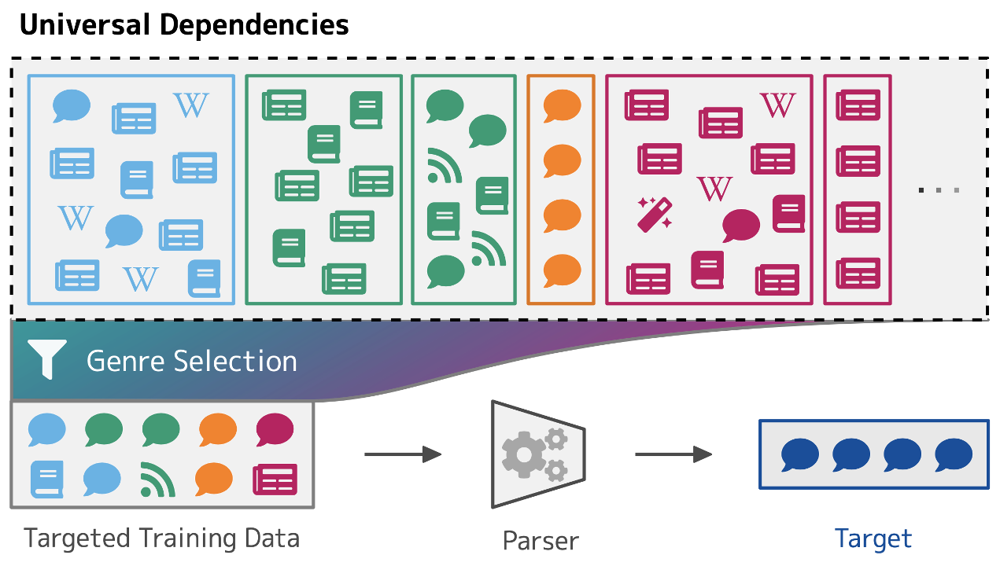

# Genre as Weak Supervision for Cross-lingual Dependency Parsing

This repository contains implementations of the data selection methods from the EMNLP 2021 paper **"Genre as Weak Supervision for Cross-lingual Dependency Parsing"** ([Müller-Eberstein, van der Goot and Plank, 2021](https://arxiv.org/abs/2109.04733)).



After installing the required packages in this directory, the experiments can be run using the provided wrapper shell scripts. Please update the variables within each script to point to the appropriate data and experiment directories on your machine.

* `run-embed.sh`: embed UD using mBERT
* `run-cluster-selection.sh`: cluster all UD treebanks using LDA and GMM and run closest cluster selection
* `run-boot-selection.sh`: train a bootstrapping classifier and use its instance-level genre predictions for genre-driven data selection
* `run-sentence-selection.sh`: run embedding-based sentence selection with the same proportions as in the main paper
* `run-random-selection.sh`: run random sentence selection with the same proportions as in the main paper

## Installation

Python 3.6+ as well as prerequisite packages are quired to run and evaluate all models. Please install them using the provided requirements file (ideally in a virtual environment):

```bash
(venv) $ pip install -r requirements.txt
```

## Experiment Data

`data/treebanks/` contains a list of the 177 treebanks used in the experiments (UD v2.7 should be obtained separetely, instructions are provided in [`data/treebanks/README.md`](data/treebanks/README.md)).

Exact data subset definitions which can be used to reconstruct the subset-corpora of UD used in our experiments can be downloaded separately [here](https://personads.me/x/emnlp-2021-data).

## Data Handling

The scripts in `data/` help preprocess UD in a consistent manner and allow for the targeted creation of data subsets.

### Creating UD Sentence Embeddings

Pre-computed sentence embeddings can be generated and saved to disk using `data/embed.py`:

```bash
# mean-pooled mBERT embeddings
(venv) $ python data/embed.py /path/to/data/treebanks/ bert-base-multilingual-cased /path/to/embeddings/
```

The language model can be set to any [Hugging Face transformer model](https://huggingface.co/). Depending on the memory available, the batch size can also be adjusted using the `-bs` parameter.

### Splitting UD

When using a subset of UD across different methods, it can be useful to have consistent train, dev and test splits. The `data/split.py` script facilitates this preprocessing step:

```bash
(venv) $ python data/split.py /path/to/output/ -p ".7,.1,.2" -ms 1000 -kt -rs 42
```

The above command creates train, dev and test splits with the proportions 70%, 10% and 20%. A maximum of 1000 sentences per treebank are sampled for train and dev. The random seed 42 ensures equal samples across runs. When no dev is available, train is split according to the proportions (use the `-ka` flag to avoid this). In order to keep testing data unchanged (e.g. test-only treebanks should not be split into train, dev, test), the `-kt` flag is supplied.

### Filtering UD

Given a split definition and filter criteria, the `data/filter.py` script can be used to create subsets of UD based on metadata. The output will be another split definition pickle `path/to/output/filtered.pkl`.

```bash
# create corpus without QTD, TR, DE data
(venv) $ python data/filter.py /path/to/data/ud-treebanks/ /path/to/split.pkl /path/to/output/ -el "Turkish German,Turkish,German"
# create Sanskrit corpus without the UFAL treebank
(venv) $ python data/filter.py /path/to/data/ud-treebanks/ /path/to/split.pkl /path/to/output/ -il "Sanskrit" -et "UFAL"
# create corpus from news-containing, non-Tamil treebanks
(venv) $ python data/filter.py /path/to/data/ud-treebanks/ /path/to/split.pkl /path/to/output/ -el "Tamil" -id "news"
```

Filters can also be applied according to predicted genre distributions instead of UD-provided metadata. A prediction pickle should then be supplied using the `-dd` option.

```bash
# create non-Telugu corpus with instances predicted as grammar
(venv) $ python data/filter.py /path/to/data/ud-treebanks/ /path/to/split.pkl /path/to/output/ -el "Telugu" -xd "grammar" --dd /path/to/predictions.pkl
```

Using the `-r` parameter, an existing split can also be subsampled to a certain size. Control replicability using the `-rs` random seed parameter.

```bash
# split subsampled to train, dev and test sizes 7k, 1k, 2k
(venv) $ python data/filter.py /path/to/data/ud-treebanks/ /path/to/split.pkl /path/to/output/ -r "7000,1000,2000" -rs 42
```

### CoNLL-U from Split Definitions

Given a split definition pickle from the functions above, a CoNLL-U corpus can be created using the `data/cat.py` script:

```bash
# create train, dev and test CoNNL-U files from split
(venv) $ python data/cat.py /path/to/data/ud-treebanks/ /path/to/split.pkl /path/to/output/
```

Some methods cannot process UD comments or multi-word tokens. The presence of both can be controlled using the `-nc` and `-nm` flags respectively.

```bash
# create CoNNL-U without comments
(venv) $ python data/cat.py /path/to/data/ud-treebanks/ /path/to/split.pkl /path/to/output/ -nc
# create CoNNL-U without multi-word tokens
(venv) $ python data/cat.py /path/to/data/ud-treebanks/ /path/to/split.pkl /path/to/output/ -nm
```

After running the script, the output directory should contain `train.conllu`, `dev.conllu` and `test.conllu` according to the split definition.

## Cluster Selection

### Latent Dirichlet Allocation (LDA)

LDA can be applied to each treebank using varying hyperparameters (character 3–6-grams in the example below). The script uses UD metdata to automatically determine the appropriate number of components for each experiment.

```bash
python cluster/lda.py /path/to/treebanks/ /path/to/output/ -cl treebank -vu char -vn 3-6 -rs 42
```

### Gaussian Mixture Models (GMM)

GMM works similarly to LDA except that it requires pre-computed sentence embeddings. These can be computed using `data/embed.py`.

```bash
python cluster/gmm.py /path/to/treebanks/ /path/to/embeddings/ /path/to/output/ -cl treebank -rs 42
```

### Closest Cluster Selection

The closest cluster for a given raw target sample (n=100 in this example) can be gathered using:

```bash
python cluster/selection.py /path/to/treebanks/ /path/to/embeddings/ /path/to/lda/ /path/to/output/ /path/to/target.pkl -ts 100 -us /path/to/genre-not-lang/splits.pkl -cl treebank -rs 42
```

## Classification Methods

### Bootstrapping (Boot)

Bootstrapped fine-tuning can be run using:

```bash
# fine-tune mBERT
(venv) $ python models/boot.py /path/to/data/ud-treebanks/ bert-base-multilingual-cased /path/to/output/ -s /path/to/split.pkl
```

### Making Predictions

The `models/predict.py` script can be used to predict genre labels using MLMs fine tuned using Boot.

```bash
# predict using fine-tuned mBERT
(venv) $ python models/predict.py /path/to/data/ud-treebanks/ bert-base-multilingual-cased /path/to/tuned-model/
```

This will produce an output predictions pickle in the `tuned-model/` directory. which can be supplied to the `-dd` paramter in the `data/filter.py` script.

## Dependency Parsing Experiments

The `parsing/` directory contains instructions for the installation of the MaChAmp parser framework in addition to the hyperparameter and dataset configuration files used in the experiments (see [`parsing/README.md`](parsing/README.md)). Predictions of each model are available to download [here](https://personads.me/x/emnlp-2021-data) in order to enable instance-level comparisons with future methods.

